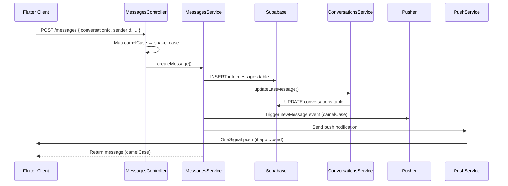
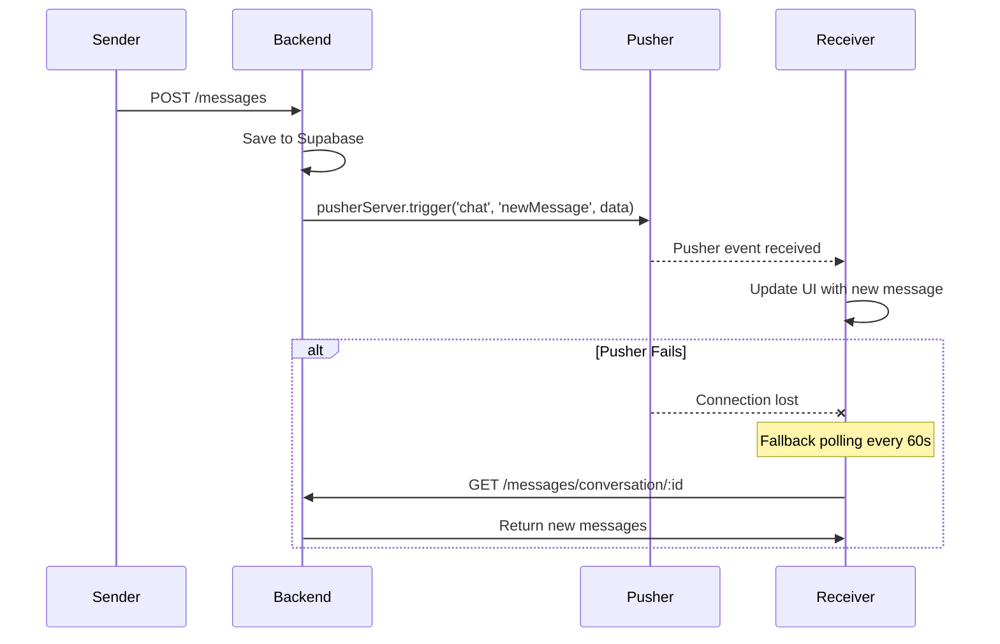
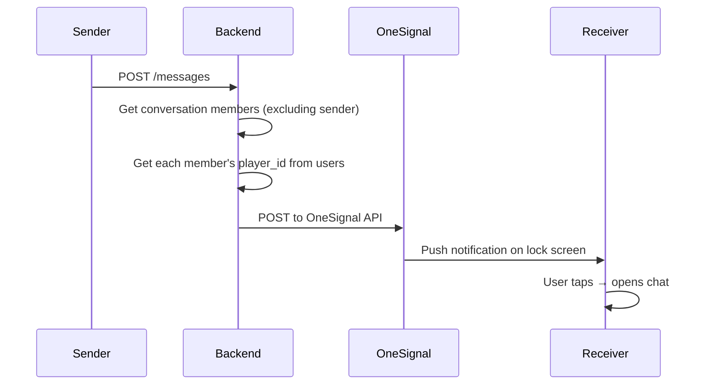

# MVChat API

NestJS Backend for WhatsApp-like Chat Application with Supabase storage and Pusher real-time messaging.

## Tech Stack
- NestJS 10.x + TypeScript
- Pusher for real-time messaging (works on serverless/Vercel)
- Supabase (PostgreSQL) for data storage
- JWT Authentication (bcrypt + jsonwebtoken)
- OneSignal for push notifications

## Prerequisites
- Node.js v22+
- npm
- Supabase project (free tier works)
- Pusher account (free tier works)

## Installation

```bash
cd api-mvchat
npm install
```

## Environment Variables

Create `.env` file in project root:

```env
PORT=3001
JWT_SECRET=mvchat-secret-key-change-in-production
JWT_EXPIRES_IN=7d
CLIENT_URL=http://localhost:3001

# Supabase Configuration
SUPABASE_URL=https://your-project.supabase.co
SUPABASE_SERVICE_ROLE_KEY=your-service-role-key
SUPABASE_ANON_KEY=your-anon-key

# Pusher Configuration
PUSHER_APP_ID=your-app-id
PUSHER_KEY=your-key
PUSHER_SECRET=your-secret
PUSHER_CLUSTER=ap1

# Google OAuth (for Google Sign-In)
GOOGLE_CLIENT_ID=your-web-oauth-client-id.apps.googleusercontent.com
GOOGLE_CLIENT_SECRET=your-oauth-client-secret

# OneSignal Push Notifications
ONESIGNAL_APP_ID=your-onesignal-app-id
ONESIGNAL_API_KEY=your-onesignal-rest-api-key
```

Note: Server runs on port 3001 (not 3000) to avoid conflicts.

## Run

```bash
# Development (with hot-reload via nodemon)
npm run start:dev

# Production
npm run build
npm run start:prod
```

Server runs on http://localhost:3001

## API Endpoints

### Authentication
| Method | Endpoint | Description |
|--------|----------|-------------|
| POST | /auth/register | Register new user |
| POST | /auth/login | Login with email/password |
| POST | /auth/google | Login with Google (OAuth) |
| POST | /auth/update-token | Update OneSignal player ID |
| GET | /auth/users | Get all users |
| GET | /auth/users/:id | Get user by ID |

### Conversations
| Method | Endpoint | Description |
|--------|----------|-------------|
| GET | /conversations | Get all conversations |
| GET | /conversations/user/:userId | Get user's conversations |
| GET | /conversations/:id | Get conversation by ID |
| GET | /conversations/:id/members | Get conversation members |
| POST | /conversations | Create conversation |
| POST | /conversations/direct/:userId1/:userId2 | Create/get direct chat |

### Messages
| Method | Endpoint | Description |
|--------|----------|-------------|
| GET | /messages/conversation/:conversationId | Get messages by conversation |
| POST | /messages | Create message (accepts camelCase or snake_case) |
| POST | /messages/upsert | Insert or update message (idempotent, accepts camelCase or snake_case) |

## Message Flow Architecture

### Send Message Flow



### Real-Time Delivery



### Push Notification Flow



## API Conventions

### Request Format
The API accepts both camelCase and snake_case in request bodies:

```json
{
  "conversationId": "uuid",
  "senderId": "uuid",
  "senderName": "John",
  "content": "Hello!",
  "type": "text"
}
```

OR

```json
{
  "conversation_id": "uuid",
  "sender_id": "uuid",
  "sender_name": "John",
  "content": "Hello!",
  "type": "text"
}
```

### Response Format
All responses return camelCase to match Flutter's model classes:

```json
{
  "id": "uuid",
  "conversationId": "uuid",
  "senderId": "uuid",
  "senderName": "John",
  "content": "Hello!",
  "type": "text",
  "createdAt": "2026-05-09T10:00:00.000Z",
  "readAt": null
}
```

## Pusher Integration

### Events Triggered
| Event | Channel | Data Format | When |
|-------|---------|-------------|------|
| newMessage | chat | camelCase | New message created |
| conversationUpdate | chat | camelCase | Conversation last message updated |

### Event Data Example (camelCase)
```javascript
await pusherServer.trigger('chat', 'newMessage', {
  id: message.id,
  conversationId: message.conversation_id,
  senderId: message.sender_id,
  senderName: message.sender_name,
  content: message.content,
  type: message.type,
  createdAt: message.created_at,
});
```

## Supabase Setup

### 1. Run Migration

Go to [Supabase SQL Editor](https://app.supabase.com/dashboard) and run the SQL from `supabase/migrations/001_initial_schema.sql`.

This creates:
- `users` table (with player_id for OneSignal)
- `conversations` table (with last_message fields)
- `conversation_members` table (many-to-many)
- `messages` table (with read_at tracking)
- Indexes for performance
- Row Level Security policies (permissive for service_role)

### 2. Get Credentials

1. Go to [Supabase Dashboard](https://supabase.com/dashboard)
2. Select your project
3. Go to **Settings → API**
4. Copy:
   - `Project URL` → `SUPABASE_URL`
   - `service_role` key → `SUPABASE_SERVICE_ROLE_KEY`
   - `anon` key → `SUPABASE_ANON_KEY`

### Schema

```
users
  id UUID PRIMARY KEY DEFAULT gen_random_uuid()
  username TEXT NOT NULL
  email TEXT NOT NULL UNIQUE
  password_hash TEXT NOT NULL
  avatar_url TEXT DEFAULT ''
  player_id TEXT DEFAULT ''
  created_at TIMESTAMPTZ DEFAULT now()

conversations
  id UUID PRIMARY KEY DEFAULT gen_random_uuid()
  name TEXT NOT NULL
  type TEXT NOT NULL CHECK (type IN ('direct', 'group'))
  last_message TEXT
  last_message_time TIMESTAMPTZ
  last_sender_id UUID
  last_sender_name TEXT
  created_at TIMESTAMPTZ DEFAULT now()

conversation_members
  conversation_id UUID REFERENCES conversations(id)
  user_id UUID REFERENCES users(id)
  role TEXT DEFAULT 'member' CHECK (role IN ('admin', 'member'))
  PRIMARY KEY (conversation_id, user_id)

messages
  id UUID PRIMARY KEY DEFAULT gen_random_uuid()
  conversation_id UUID NOT NULL REFERENCES conversations(id)
  sender_id UUID NOT NULL REFERENCES users(id)
  sender_name TEXT NOT NULL
  content TEXT NOT NULL
  type TEXT DEFAULT 'text' CHECK (type IN ('text', 'image'))
  created_at TIMESTAMPTZ DEFAULT now()
  read_at TIMESTAMPTZ
```

### Indexes
- `idx_messages_conversation_created` on messages(conversation_id, created_at)
- `idx_conversation_members_user` on conversation_members(user_id)
- `idx_conversation_members_conversation` on conversation_members(conversation_id)
- `idx_users_email` on users(email)

## Project Structure

```
api-mvchat/
├── src/
│   ├── main.ts                       # Entry point, CORS, ValidationPipe
│   ├── app.module.ts                 # Root module
│   ├── config/
│   │   ├── config.module.ts
│   │   ├── config.service.ts
│   │   ├── supabase.service.ts       # Supabase CRUD operations
│   │   ├── pusher.config.ts          # Pusher server instance
│   │   └── push.service.ts           # OneSignal push notifications
│   ├── auth/
│   │   ├── auth.module.ts
│   │   ├── auth.service.ts
│   │   ├── auth.controller.ts
│   │   └── jwt.strategy.ts
│   ├── users/
│   │   ├── users.module.ts
│   │   ├── users.service.ts
│   │   └── users.controller.ts
│   ├── conversations/
│   │   ├── conversations.module.ts
│   │   ├── conversations.service.ts
│   │   └── conversations.controller.ts
│   ├── messages/
│   │   ├── messages.module.ts
│   │   ├── messages.service.ts       # CRUD + Pusher triggers + push
│   │   └── messages.controller.ts    # camelCase/snake_case handling
│   └── common/
│       ├── interfaces.ts             # TypeScript interfaces
│       └── interceptors/
│           └── logging.interceptor.ts # Request/response logging
├── supabase/
│   └── migrations/
│       └── 001_initial_schema.sql    # Database schema
├── .env
├── package.json
├── tsconfig.json
├── tsconfig.build.json
└── nest-cli.json
```

## Key Design Decisions

### camelCase API
- Backend stores data in snake_case (Supabase convention)
- API accepts both formats in requests
- API always responds with camelCase to match Flutter's `MessageModel.fromJson`
- Pusher events also use camelCase for consistency

### Real-Time via Pusher + Polling
- Pusher WebSocket for instant delivery
- 60-second polling as fallback when WebSocket disconnects
- Works on serverless platforms (Vercel) where persistent connections limited

### Duplicate Prevention
- `upsertMessage` checks for existing message by ID before creating
- Frontend optimistically adds message, deduplicates by ID
- Pusher events carry real UUID from database

### Direct Conversation Names
- When creating a direct conversation via `findOrCreateDirectConversation`, the backend looks up both users' profiles and stores `"{username1} & {username2}"` as the conversation name
- Previously used `dm_{userId1}_{userId2}` (raw UUIDs)
- The Flutter client further resolves this to show only the other participant's name

### CORS Configuration
- Explicit origins: `['http://localhost:54321', 'http://localhost:3000', 'http://localhost:3001']`
- `credentials: true` is kept for future cookie-based auth
- Using `origin: '*'` with `credentials: true` is rejected by browsers per CORS spec

## Troubleshooting

### Supabase connection failed
1. Verify SUPABASE_URL and SUPABASE_SERVICE_ROLE_KEY in .env
2. Run migration SQL in Supabase dashboard
3. Ensure tables exist: users, conversations, conversation_members, messages
4. Check backend logs for `[SupabaseService] Supabase connected successfully`

### Port already in use
```bash
netstat -ano | findstr :3001
taskkill /PID <PID> /F
```

### Pusher not working
- Verify PUSHER_KEY, PUSHER_SECRET, PUSHER_APP_ID, PUSHER_CLUSTER in .env
- Check Pusher dashboard for event delivery logs
- Ensure Flutter client subscribes to the correct channel (`chat`)

### Messages not appearing
1. Check backend logs: `[MessagesService] Pusher triggered for message: ...`
2. Verify Supabase messages table has data
3. Test with curl: `curl -X POST http://localhost:3001/messages -H "Content-Type: application/json" -d '{"conversationId":"...","senderId":"...","content":"test"}'`

### Push notifications not showing
- Check ONESIGNAL_APP_ID and ONESIGNAL_API_KEY in .env
- Verify player_id is being saved in users table
- Check OneSignal dashboard for notification delivery status

## Example Usage

### Register User
```bash
curl -X POST http://localhost:3001/auth/register \
  -H "Content-Type: application/json" \
  -d '{"username":"john","email":"john@example.com","password":"123456"}'
```

### Login
```bash
curl -X POST http://localhost:3001/auth/login \
  -H "Content-Type: application/json" \
  -d '{"email":"john@example.com","password":"123456"}'
```

### Send Message
```bash
curl -X POST http://localhost:3001/messages \
  -H "Content-Type: application/json" \
  -H "Authorization: Bearer <TOKEN>" \
  -d '{"conversationId":"<conv-id>","senderId":"<user-id>","senderName":"John","content":"Hello!"}'
```

### Get Messages
```bash
curl -X GET http://localhost:3001/messages/conversation/<conv-id> \
  -H "Authorization: Bearer <TOKEN>"
```
