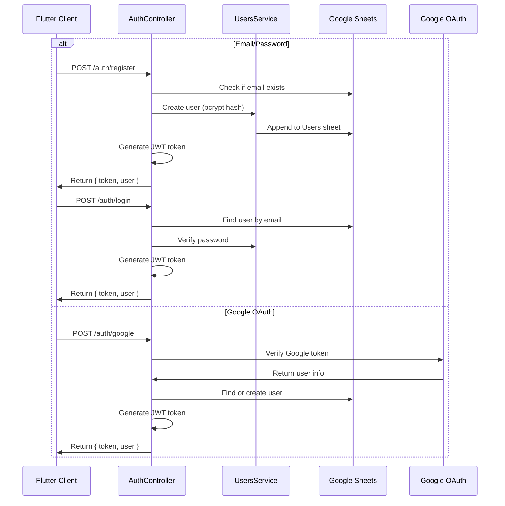
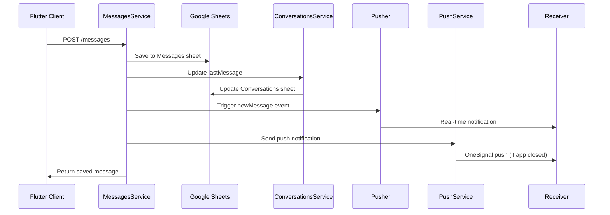
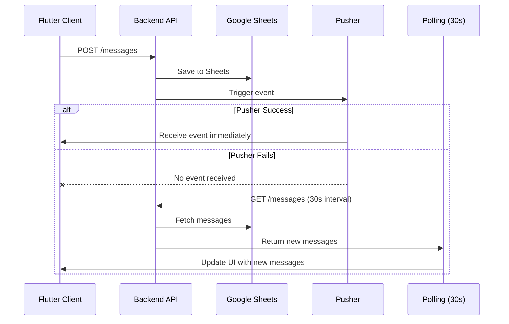
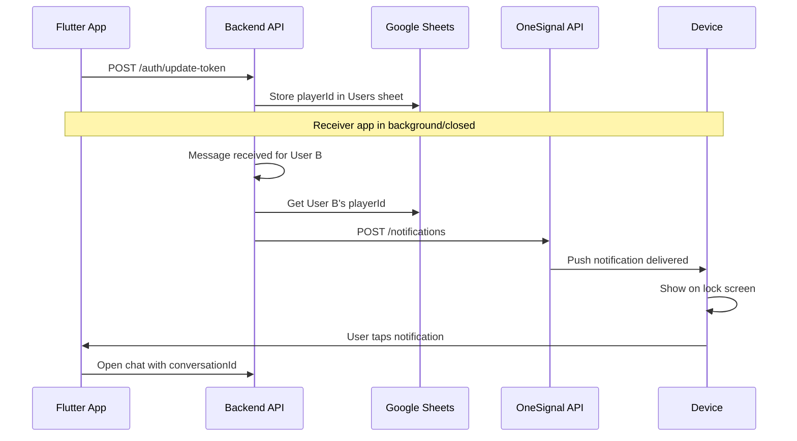
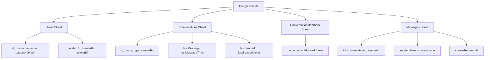

# MVChat API

NestJS Backend for WhatsApp-like Chat Application with Google Sheets storage.

## Tech Stack
- NestJS 10.x + TypeScript
- Pusher for real-time messaging (works on serverless/Vercel)
- Google Sheets API for data storage
- JWT Authentication

## Prerequisites
- Node.js v22+

## Installation

```bash
cd /mnt/d/Projects/Nestjs/api-mvchat
npm install
```

## Environment Variables

Create `.env` file in project root:

```env
PORT=3001
JWT_SECRET=mvchat-secret-key-change-in-production
JWT_EXPIRES_IN=7d
GOOGLE_SPREADSHEET_ID=10bLHBJ0rWQyaDv2uVwYmNVNxcBHX2tZw3B01RSkXrxc
CLIENT_URL=http://localhost:3001
GOOGLE_SERVICE_ACCOUNT_KEY={"type": "service_account","project_id": "xxx",...}

# Pusher Configuration
PUSHER_APP_ID=1403689
PUSHER_KEY=67678fab751961ef6d68
PUSHER_SECRET=dd87d1976ef3266e7cd2
PUSHER_CLUSTER=ap1

# Google OAuth (for Google Sign-In)
GOOGLE_CLIENT_ID=your-web-oauth_client_id.apps.googleusercontent.com

# OneSignal Push Notifications
ONESIGNAL_APP_ID=your-onesignal-app-id
ONESIGNAL_API_KEY=your-onesignal-rest-api-key
```

Note: Server runs on port 3001 (not 3000) to avoid conflicts.

## Google Sheets Setup

Your spreadsheet must have these sheets:

### 1. Users Sheet
| Column | Header |
|--------|--------|
| A | id |
| B | username |
| C | email |
| D | passwordHash |
| E | avatarUrl |
| F | createdAt |
| G | playerId (OneSignal push notification ID) |

### 2. Conversations Sheet
| Column | Header |
|--------|--------|
| A | id |
| B | name |
| C | type |
| D | createdAt |

### 3. ConversationMembers Sheet
| Column | Header |
|--------|--------|
| A | conversation_id |
| B | user_id |
| C | role |

### 4. Messages Sheet
| Column | Header |
|--------|--------|
| A | id |
| B | conversationId |
| C | senderId |
| D | senderName |
| E | content |
| F | type |
| G | createdAt |
| H | readAt |

**Important:** The Messages sheet includes senderName in column D.

## Run

```bash
# Development
npm run start:dev

# Production
npm run build
npm run start:prod
```

Server runs on http://localhost:3001

## API Endpoints

### Authentication
| Method | Endpoint | Description |
|--------|----------|-------------|
| POST | /auth/register | Register new user |
| POST | /auth/login | Login with email/password |
| POST | /auth/google | Login with Google (OAuth) |
| GET | /auth/users | Get all users |
| GET | /auth/users/:id | Get user by ID |

### Conversations
| Method | Endpoint | Description |
|--------|----------|-------------|
| GET | /conversations | Get all conversations |
| GET | /conversations/user/:userId | Get user's conversations |
| GET | /conversations/:id | Get conversation by ID |
| GET | /conversations/:id/members | Get conversation members |
| POST | /conversations | Create conversation |
| POST | /conversations/direct/:userId1/:userId2 | Create/get direct chat |

### Messages
| Method | Endpoint | Description |
|--------|----------|-------------|
| GET | /messages/conversation/:conversationId | Get messages by conversation |
| POST | /messages | Create message (saves to Google Sheets + triggers Pusher) |
| POST | /messages/upsert | Insert or update message (idempotent) |

## Message Flow Architecture

This backend uses Pusher for real-time messaging, which works on serverless platforms like Vercel.

### Authentication Flow



### Send Message Flow



### Real-time Update Flow (with Fallback)



### Push Notification Flow



### Data Architecture



### Why This Architecture?
- Works on serverless platforms (Vercel) where WebSocket is not supported
- Pusher provides reliable real-time delivery
- Polling as backup ensures no missed messages
- OneSignal push notifications work when app is closed
- Prevents duplicate messages via upsert logic

## Pusher Integration

The backend triggers a Pusher event after saving each message to Google Sheets:

```javascript
// Trigger Pusher after saving
await pusherServer.trigger('chat', 'newMessage', {
  id: message.id,
  conversationId: message.conversationId,
  senderId: message.senderId,
  senderName: message.senderName,
  content: message.content,
  type: message.type,
  createdAt: message.createdAt,
});
```

### Pusher Channel
- Channel: `chat` (general) and `chat-{conversationId}` (per conversation)
- Event: `newMessage`

## Example Usage

### Register User
```bash
curl -X POST http://localhost:3001/auth/register \
  -H "Content-Type: application/json" \
  -d '{"username":"john","email":"john@example.com","password":"123456"}'
```

### Login
```bash
curl -X POST http://localhost:3001/auth/login \
  -H "Content-Type: application/json" \
  -d '{"email":"john@example.com","password":"123456"}'
```

### Send Message
```bash
curl -X POST http://localhost:3001/messages \
  -H "Content-Type: application/json" \
  -H "Authorization: Bearer <TOKEN>" \
  -d '{"conversationId":"conv_xxx","senderId":"usr_xxx","content":"Hello!"}'
```

### Get Messages
```bash
curl -X GET http://localhost:3001/messages/conversation/conv_xxx \
  -H "Authorization: Bearer <TOKEN>"
```

## Troubleshooting

### Google Sheets error
1. Verify service account has access to spreadsheet
2. Check GOOGLE_SERVICE_ACCOUNT_KEY is valid JSON
3. Ensure spreadsheet ID is correct

### Port already in use
```bash
# Find process using port 3001
netstat -tlnp | grep 3001

# Change port in .env
PORT=3002
```

### Messages not showing
- Check Messages sheet has correct headers (8 columns including senderName)
- Verify column D header is "senderName"
- Check console for error logs by running `npm run start:dev`

### Pusher not working
- Verify Pusher credentials in .env are correct
- Check Pusher app is active in pusher.com dashboard
- Verify cluster matches (e.g., ap1, us2)

### Push notifications not showing
- Check OneSignal credentials in .env
- Verify app has internet permission
- Check OneSignal dashboard for notification delivery status
- Ensure playerId is saved to Users sheet (column G)

## Push Notifications

The app uses OneSignal for push notifications when users receive messages while the app is closed or in background.

### How It Works

```
1. User opens app → OneSignal SDK registers device → playerId sent to backend
2. Backend stores playerId in Users sheet (column G)
3. When message saved → Backend calls OneSignal API → Receiver gets notification
4. Notification shows: "ConversationName: Sender: message preview"
```

### Setup OneSignal

1. Create account at [OneSignal.com](https://onesignal.com)
2. Create new app → Get `ONESIGNAL_APP_ID` and `ONESIGNAL_API_KEY`
3. Add credentials to `.env`
4. Download `google-services.json` from OneSignal setup → place in Flutter `android/app/`

## Project Structure

```
api-mvchat/
├── src/
│   ├── main.ts                 # Entry point
│   ├── app.module.ts           # Root module
│   ├── config/               # Configuration
│   │   ├── config.module.ts
│   │   ├── config.service.ts
│   │   ├── google-sheets.service.ts
│   │   ├── pusher.config.ts   # Pusher server configuration
│   │   └── push.service.ts    # OneSignal push notification service
│   ├── auth/                 # Authentication
│   │   ├── auth.module.ts
│   │   ├── auth.service.ts
│   │   ├── auth.controller.ts
│   │   └── jwt.strategy.ts
│   ├── users/               # User management
│   │   ├── users.module.ts
│   │   ├── users.service.ts
│   │   └── users.controller.ts
│   ├── conversations/        # Chat rooms
│   │   ├── conversations.module.ts
│   │   ├── conversations.service.ts
│   │   └── conversations.controller.ts
│   ├── messages/           # Messages
│   │   ├── messages.module.ts
│   │   ├── messages.service.ts
│   │   └── messages.controller.ts
│   └── common/             # Shared
│       └── interfaces.ts
├── .env                   # Environment variables
├── package.json
├── tsconfig.json
└── nest-cli.json
```