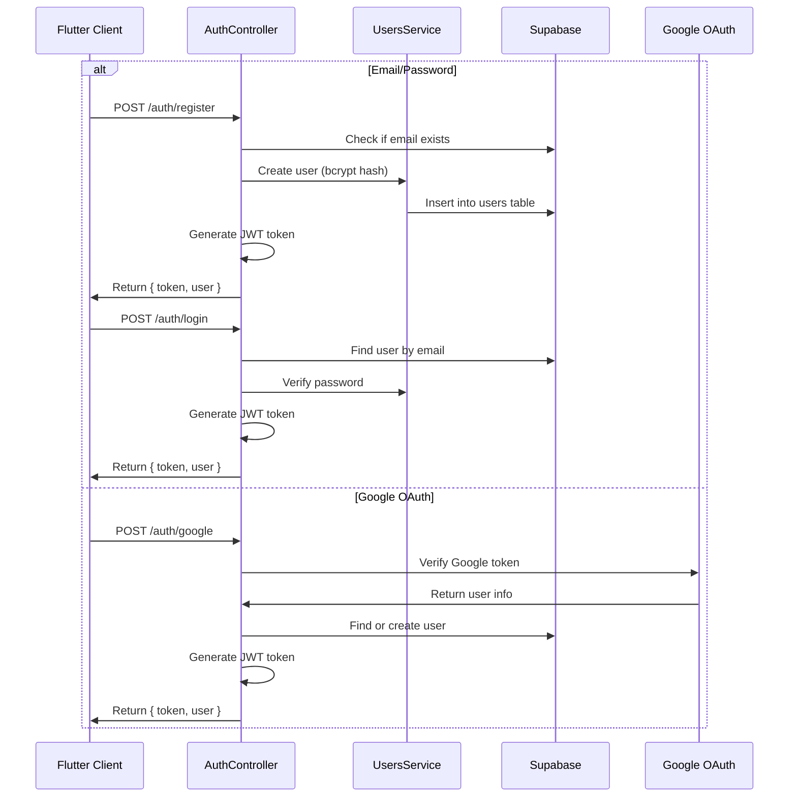
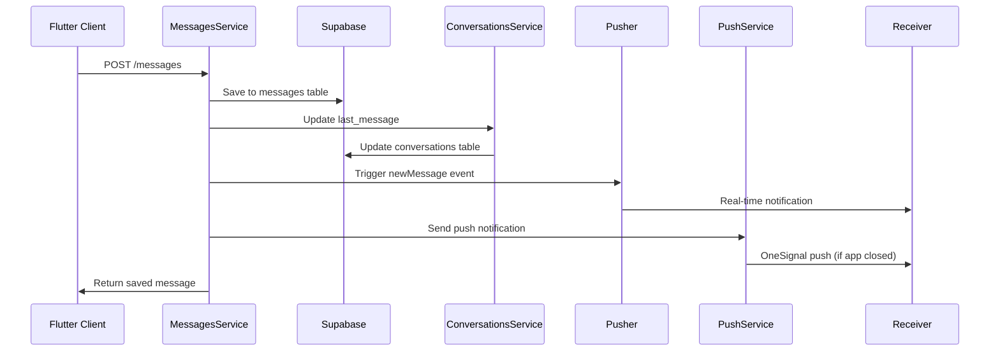
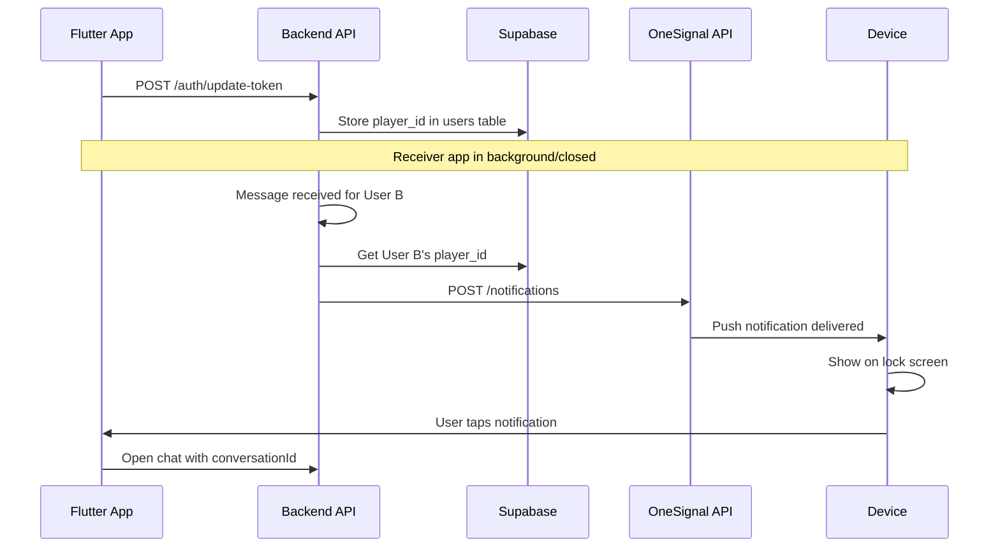
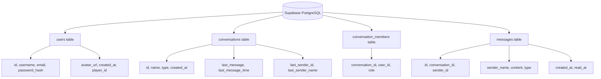

# MVChat API

NestJS Backend for WhatsApp-like Chat Application with Supabase storage.

## Tech Stack
- NestJS 10.x + TypeScript
- Pusher for real-time messaging (works on serverless/Vercel)
- Supabase (PostgreSQL) for data storage
- JWT Authentication
- OneSignal for push notifications

## Prerequisites
- Node.js v22+
- Supabase project (free tier works)

## Installation

```bash
cd api-mvchat
npm install
```

## Environment Variables

Create `.env` file in project root:

```env
PORT=3001
JWT_SECRET=mvchat-secret-key-change-in-production
JWT_EXPIRES_IN=7d
CLIENT_URL=http://localhost:3001

# Supabase Configuration
SUPABASE_URL=https://your-project.supabase.co
SUPABASE_SERVICE_ROLE_KEY=your-service-role-key
SUPABASE_ANON_KEY=your-anon-key

# Pusher Configuration
PUSHER_APP_ID=your-app-id
PUSHER_KEY=your-key
PUSHER_SECRET=your-secret
PUSHER_CLUSTER=ap1

# Google OAuth (for Google Sign-In)
GOOGLE_CLIENT_ID=your-web-oauth_client_id.apps.googleusercontent.com

# OneSignal Push Notifications
ONESIGNAL_APP_ID=your-onesignal-app-id
ONESIGNAL_API_KEY=your-onesignal-rest-api-key
```

Note: Server runs on port 3001 (not 3000) to avoid conflicts.

## Supabase Setup

### 1. Run Migration

Go to [Supabase SQL Editor](https://app.supabase.com/dashboard) and run the SQL from `supabase/migrations/001_initial_schema.sql`.

This creates:
- `users` table (with player_id for OneSignal)
- `conversations` table (with last_message fields)
- `conversation_members` table (many-to-many)
- `messages` table (with read_at tracking)
- Indexes for performance
- Row Level Security policies
- Realtime subscriptions enabled

### 2. Get Credentials

1. Go to [Supabase Dashboard](https://supabase.com/dashboard)
2. Select your project
3. Go to **Settings → API**
4. Copy:
   - `Project URL` → `SUPABASE_URL`
   - `service_role` key → `SUPABASE_SERVICE_ROLE_KEY`
   - `anon` key → `SUPABASE_ANON_KEY`

### 3. Database Schema

```
users (id, username, email, password_hash, avatar_url, player_id, created_at)
conversations (id, name, type, last_message, last_message_time, last_sender_id, last_sender_name, created_at)
conversation_members (conversation_id, user_id, role)
messages (id, conversation_id, sender_id, sender_name, content, type, created_at, read_at)
```

## Run

```bash
# Development
npm run start:dev

# Production
npm run build
npm run start:prod
```

Server runs on http://localhost:3001

## API Endpoints

### Authentication
| Method | Endpoint | Description |
|--------|----------|-------------|
| POST | /auth/register | Register new user |
| POST | /auth/login | Login with email/password |
| POST | /auth/google | Login with Google (OAuth) |
| POST | /auth/update-token | Update OneSignal player ID |
| GET | /auth/users | Get all users |
| GET | /auth/users/:id | Get user by ID |

### Conversations
| Method | Endpoint | Description |
|--------|----------|-------------|
| GET | /conversations | Get all conversations |
| GET | /conversations/user/:userId | Get user's conversations |
| GET | /conversations/:id | Get conversation by ID |
| GET | /conversations/:id/members | Get conversation members |
| POST | /conversations | Create conversation |
| POST | /conversations/direct/:userId1/:userId2 | Create/get direct chat |

### Messages
| Method | Endpoint | Description |
|--------|----------|-------------|
| GET | /messages/conversation/:conversationId | Get messages by conversation |
| POST | /messages | Create message |
| POST | /messages/upsert | Insert or update message (idempotent) |

## Message Flow Architecture

### Authentication Flow



### Send Message Flow



### Real-time Update Flow (with Fallback)


### Push Notification Flow



### Data Architecture



### Why This Architecture?
- Works on serverless platforms (Vercel) where WebSocket is not supported
- Pusher provides reliable real-time delivery
- Polling as backup ensures no missed messages
- OneSignal push notifications work when app is closed
- Prevents duplicate messages via upsert logic
- Supabase provides relational data with real-time CDC

## Pusher Integration

The backend triggers a Pusher event after saving each message:

```javascript
// Trigger Pusher after saving
await pusherServer.trigger('chat', 'newMessage', {
  id: message.id,
  conversation_id: message.conversation_id,
  sender_id: message.sender_id,
  sender_name: message.sender_name,
  content: message.content,
  type: message.type,
  created_at: message.created_at,
});
```

### Pusher Channel
- Channel: `chat` (general) and `chat-{conversationId}` (per conversation)
- Event: `newMessage`, `conversationUpdate`

## Example Usage

### Register User
```bash
curl -X POST http://localhost:3001/auth/register \
  -H "Content-Type: application/json" \
  -d '{"username":"john","email":"john@example.com","password":"123456"}'
```

### Login
```bash
curl -X POST http://localhost:3001/auth/login \
  -H "Content-Type: application/json" \
  -d '{"email":"john@example.com","password":"123456"}'
```

### Send Message
```bash
curl -X POST http://localhost:3001/messages \
  -H "Content-Type: application/json" \
  -H "Authorization: Bearer <TOKEN>" \
  -d '{"conversation_id":"conv-xxx","sender_id":"usr-xxx","content":"Hello!"}'
```

### Get Messages
```bash
curl -X GET http://localhost:3001/messages/conversation/conv-xxx \
  -H "Authorization: Bearer <TOKEN>"
```

## Troubleshooting

### Supabase connection failed
1. Verify SUPABASE_URL and SUPABASE_SERVICE_ROLE_KEY in .env
2. Check migration SQL was run successfully in Supabase dashboard
3. Ensure tables exist: users, conversations, conversation_members, messages

### Port already in use
```bash
# Find process using port 3001
netstat -tlnp | grep 3001

# Change port in .env
PORT=3002
```

### Messages not showing
- Check Supabase messages table has correct schema
- Run SQL migration if tables are missing
- Check console for error logs by running `npm run start:dev`

### Pusher not working
- Verify Pusher credentials in .env are correct
- Check Pusher app is active in pusher.com dashboard
- Verify cluster matches (e.g., ap1, us2)

### Push notifications not showing
- Check OneSignal credentials in .env
- Verify app has internet permission
- Check OneSignal dashboard for notification delivery status
- Ensure player_id is saved in users table

## Push Notifications

The app uses OneSignal for push notifications when users receive messages while the app is closed or in background.

### How It Works

```
1. User opens app → OneSignal SDK registers device → player_id sent to backend
2. Backend stores player_id in users table
3. When message saved → Backend calls OneSignal API → Receiver gets notification
4. Notification shows: "ConversationName: Sender: message preview"
```

### Setup OneSignal

1. Create account at [OneSignal.com](https://onesignal.com)
2. Create new app → Get `ONESIGNAL_APP_ID` and `ONESIGNAL_API_KEY`
3. Add credentials to `.env`
4. Download `google-services.json` from OneSignal setup → place in Flutter `android/app/`

## Project Structure

```
api-mvchat/
├── src/
│   ├── main.ts                 # Entry point
│   ├── app.module.ts           # Root module
│   ├── config/                 # Configuration
│   │   ├── config.module.ts
│   │   ├── config.service.ts
│   │   ├── supabase.service.ts    # Supabase CRUD operations
│   │   ├── pusher.config.ts    # Pusher server configuration
│   │   └── push.service.ts     # OneSignal push notification service
│   ├── auth/                   # Authentication
│   │   ├── auth.module.ts
│   │   ├── auth.service.ts
│   │   ├── auth.controller.ts
│   │   └── jwt.strategy.ts
│   ├── users/                  # User management
│   │   ├── users.module.ts
│   │   ├── users.service.ts
│   │   └── users.controller.ts
│   ├── conversations/          # Chat rooms
│   │   ├── conversations.module.ts
│   │   ├── conversations.service.ts
│   │   └── conversations.controller.ts
│   ├── messages/               # Messages
│   │   ├── messages.module.ts
│   │   ├── messages.service.ts
│   │   └── messages.controller.ts
│   └── common/                 # Shared
│       └── interfaces.ts
├── supabase/
│   └── migrations/
│       └── 001_initial_schema.sql  # Database schema
├── .env                        # Environment variables
├── package.json
├── tsconfig.json
└── nest-cli.json
```
